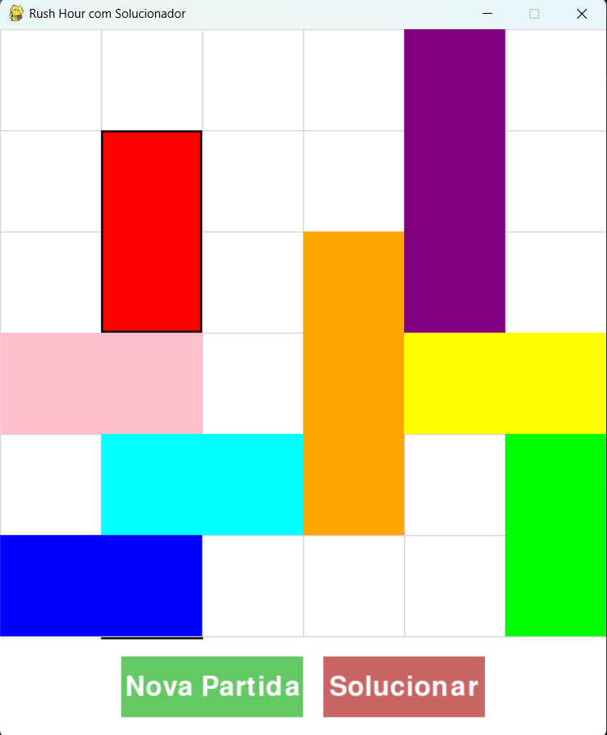
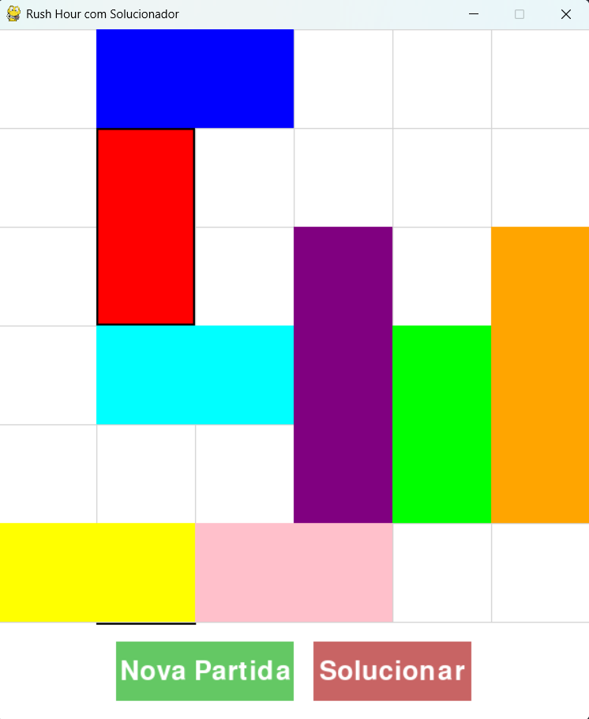
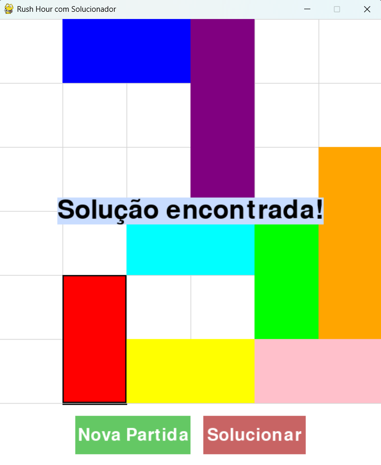

# Grafos 1 - RushHour

**Número da Lista**: 1  
**Conteúdo da Disciplina**: FGA0124 - PROJETO DE ALGORITMOS - T01  


## Alunos


<div align = "center">
<table>
  <tr>
    <td align="center"><a href="https://github.com/CarolinaBarb"><br /><sub><b>Carolina Barbosa </b></sub></a><br/></td>
    <td align="center"><a href="https://github.com/JuliaSSouza"><br /><sub><b>Julia Sant'Anna</b></sub></a><br />
  </tr>
</table>


| Matrícula   | Aluno                             |
| ----------- | ---------------------------------- |
| 211030961 | Carolina Barbosa Brito           |
| 202044144  | Julia Sant'Anna de Souza      |
</div>

## Sobre 

O projeto se trata de uma implementação do jogo de quebra-cabeça "Rush Hour" utilizando a biblioteca Pygame. O objetivo é mover um bloco vermelho principal através de uma grade 6x6, manobrando outros blocos que obstruem o caminho, até a saída designada usando a busa em largura (BFS).

## Screenshots

### Jogo resolvido por uma pessoa
<p align="center">
  
</p>

<p align="center">
  
</p>

### Jogo solucionado com o menor número de movimentos usando bfs
<p align="center">
  
</p>

<p align="center">
  
</p>

## Como rodar o projeto
### instalação 
Para executar o projeto será preciso ter **Python** instalado em seu computador

#### Clone o repositório
```bash
git clone https://github.com/projeto-de-algoritmos-2025/Grafos-1-RushHour-D12.git
```
#### Instale a biblioteca pygame
```bash
pip install pygame
```
#### Execute o script Python
```bash
python main.py
```

## Apresentação 
[Vídeo](https://www.youtube.com/watch?v=oQbqbeBKatM)

 
 


